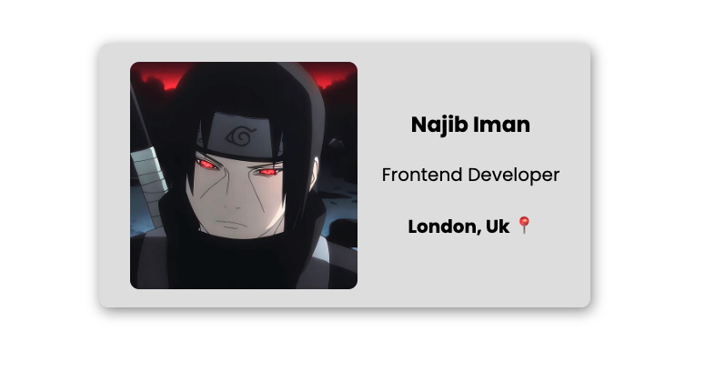

# Digital Business Card

Welcome to my digital business card! This project showcases a simple business card design using HTML and CSS. The card features a profile image, name, job title, and location.

## Lessons Learned

1. **Image Alt Texts:**: Understanding the importance of providing descriptive alt text for images to improve accessibility and SEO.
2. **Flex Child Containers**: Utilizing flexbox to create flexible layouts and align items within containers efficiently.
3. **Inheritance**: Exploring CSS inheritance to apply styles to child elements based on the styles of their parent elements.
4. **Web Safe Fonts**: Choosing web-safe fonts to ensure consistent typography across different browsers and devices.
5. **Color Palettes**: Creating and using color palettes effectively to maintain visual harmony and consistency in web design.

## Technologies Used

- HTML
- CSS

## Installation

1. Clone this repository: `git clone https://github.com/your-username/business-card.git`
2. Open `index.html` in your web browser.

## Live Demo

Check out the business card [here](https://business-card-pearl-pi.vercel.app/)

## Contributing

Contributions are welcome! If you have any suggestions for improvement or would like to add new features, please open an issue or submit a pull request.

## License

This project is licensed under the [MIT License](LICENSE).

**Author:** [Your Name](https://github.com/najibdevs)  
**Date:** May 8, 2024

